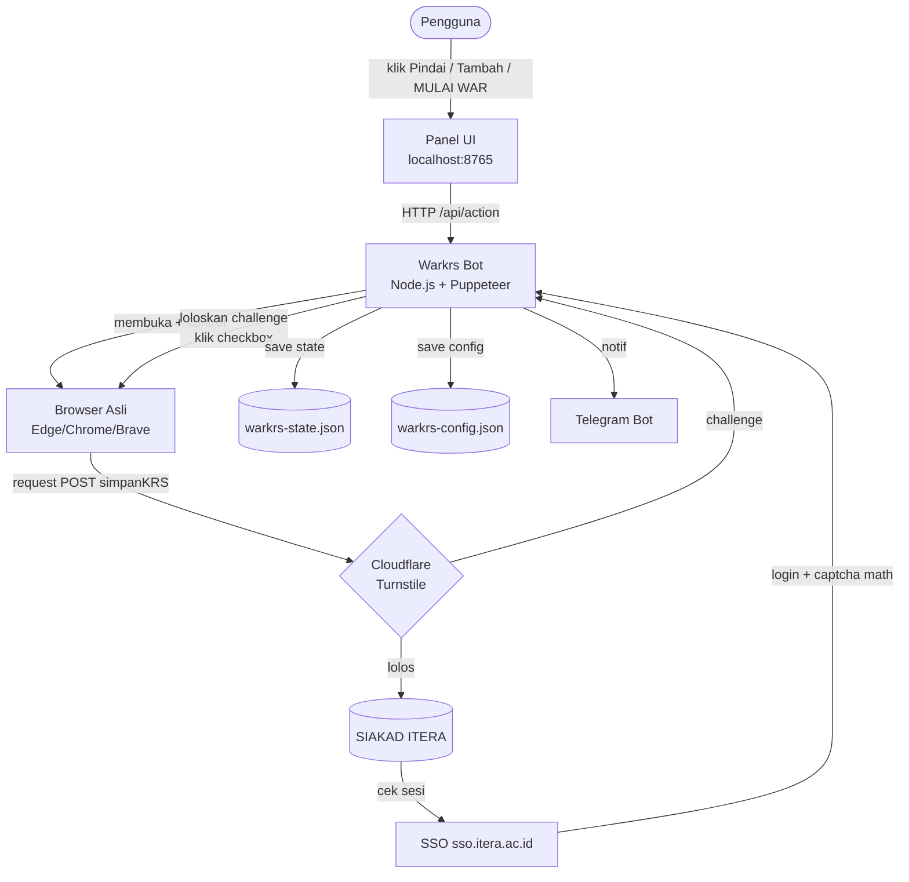
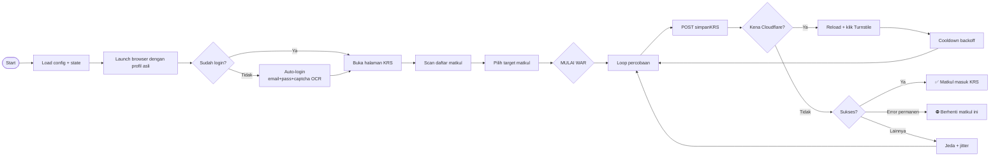
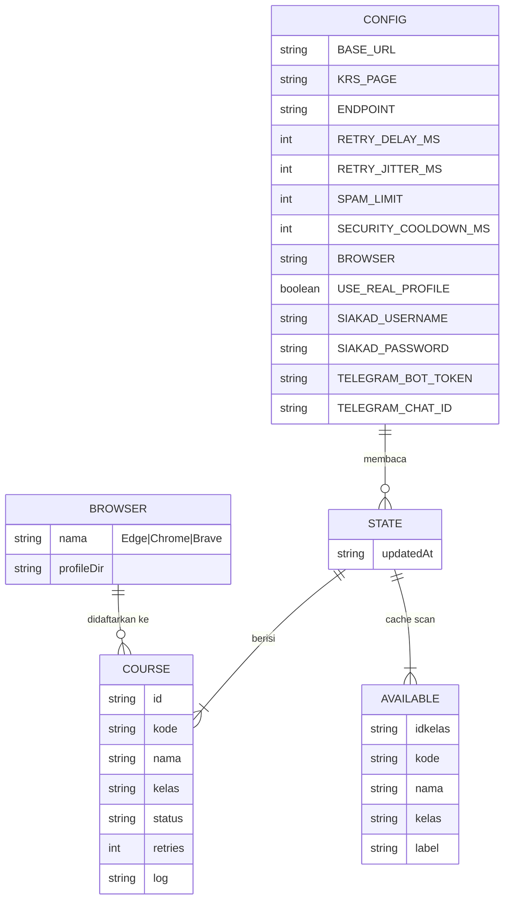

# ⚔ WAR KRS — Auto-Enroll KRS SIAKAD ITERA

> Auto-enroll mata kuliah KRS dengan **panel UI di browser**, dijalankan dari **terminal**. Tahan refresh SIAKAD, lolos Cloudflare & Turnstile, login ulang otomatis, dan progres tersimpan aman.

**WAR KRS** adalah bot automasi pengisian KRS (Kartu Rencana Studi) untuk SIAKAD ITERA. Bot mengendalikan browser asli kamu (Edge / Chrome / Brave) dengan profil pribadi, membuka panel kontrol di tab terpisah, lalu melakukan request pendaftaran matkul secara otomatis sampai berhasil — dengan deteksi anti-bot yang mumpuni.

---

## ✨ Fitur Unggulan

| Fitur | Deskripsi |
|---|---|
| 🖥 **Panel UI** | Cari & klik `+` untuk menambah matkul, pantau status war real-time — tanpa ngetik command |
| 🛡 **Lolos Cloudflare** | Stealth mode + auto-klik Turnstile "Verify you are human" di semua frame |
| 🔑 **Login ulang otomatis** | Isi email + password + pecahkan **captcha matematika** via OCR (tesseract.js) |
| 🌐 **Multi-browser** | Edge / Chrome / Brave, pakai profil asli kamu |
| ⚔ **War otomatis** | Retry + jitter acak, backoff cooldown, stop saat error permanen |
| 📊 **Deteksi SKS** | Hentikan otomatis saat jatah SKS penuh |
| 💬 **Notifikasi Telegram** | Pantau dari HP saat war berjalan |
| 💾 **State tersimpan** | Tahan restart — lanjut dari yang belum berhasil |

---

## 🏗 Arsitektur

### Data Flow Diagram (DFD Level 0)



### Data Flow Diagram (Level 1 — Alur War)



### Entity Relationship Diagram (ERD)



---

## 🚀 Instalasi

**Persyaratan:**

- **Node.js** v18+ (disarankan v20+)
- **Chrome / Edge / Brave** terpasang
- **Cross-platform**: Windows, macOS, Linux

```bash
git clone https://github.com/udinvoldigoad/WarKRS_ITERA.git
cd warkrs
npm install
```

---

## 🕹 Cara Pakai (paling cepat)

```bash
npm start          # atau double-click KLIK-UNTUK-WAR.bat
```

1. **Tutup browser kamu** (profil asli terkunci saat browser jalan).
2. Browser otomatis terbuka dengan 2 tab: **Panel** (`http://127.0.0.1:8765`) + **SIAKAD**.
3. Kalau belum login → buka tab SIAKAD → login sekali (tersimpan). *Opsional: isi NIM + Password di tab Config agar **login ulang otomatis** saat sesi kedaluwarsa.*
4. Di panel: klik **Pindai** → ketik di kolom cari → klik **+** pada matkul tujuan.
5. Klik **MULAI WAR** — pantau status di panel, lihat SIAKAD di tab sebelah.

> **Penting**: Jangan tutup browser saat war berjalan. Kalau sesi kedaluwarsa, bot login ulang otomatis (atau tunggu login manual di tab SIAKAD) lalu war lanjut.

---

## 📟 Perintah Terminal

| Perintah | Fungsi |
|---|---|
| `npm start` / `node warkrs-bot.js panel` | Buka panel UI |
| `node warkrs-bot.js doctor` | Diagnostik (browser, login, periode KRS) |
| `node warkrs-bot.js login` | Login sekali di jendela otomatis (tersimpan) |
| `node warkrs-bot.js scan [filter]` | Pindai daftar kelas |
| `node warkrs-bot.js add "Nama - Kelas"` | Tambah target |
| `node warkrs-bot.js list` | Lihat target |
| `node warkrs-bot.js war` | MULAI WAR (CLI) |
| `node warkrs-bot.js config set KEY VALUE` | Ubah config |

**Format input `add` fleksibel** — semuanya jalan:

```
Kapita Selekta - RA
43106
IF25-21008 - Jaringan Komputer - RA
43106  IF25-21008 - Jaringan Komputer - RA   (copy dari hasil scan)
```

---

## ⚙️ Konfigurasi

Config disimpan di `warkrs-config.json` (dibuat otomatis). Key penting:

| Key | Default | Fungsi |
|---|---|---|
| `BROWSER` | `auto` | `auto` / `edge` / `chrome` / `brave` |
| `USE_REAL_PROFILE` | `true` | Pakai profil asli browser (harus tutup browser dulu) |
| `RETRY_DELAY_MS` | `5000` | Jeda antar percobaan |
| `RETRY_JITTER_MS` | `3000` | Variasi acak biar tidak terlihat bot |
| `SPAM_LIMIT` | `0` | 0 = tanpa batas |
| `SECURITY_COOLDOWN_MS` | `60000` | Cooldown awal saat kena proteksi (backoff bertahap) |
| `RELOAD_EVERY_ATTEMPTS` | `15` | Reload halaman tiap N percobaan (segar-kan sesi) |
| `AUTO_STOP_SKS` | `true` | Hentikan otomatis saat SKS penuh |
| `SIAKAD_USERNAME` / `SIAKAD_PASSWORD` | `""` | Kredensial untuk **login ulang otomatis** |
| `TELEGRAM_BOT_TOKEN` / `TELEGRAM_CHAT_ID` | `""` | Notifikasi Telegram (opsional) |

Contoh: `node warkrs-bot.js config set RETRY_DELAY_MS 8000`

---

## 🔐 Keamanan untuk Developer

⚠️ **JANGAN commit file ini** (sudah di `.gitignore`):

| File | Isi |
|---|---|
| `warkrs-config.json` | Cookie sesi login & kredensial |
| `warkrs-state.json` | Target & data pribadi |
| `.warkrs-profile-*` | Profil browser berisi sesi login |
| `opencode.json` | API key MCP |
| `captcha-debug/` | Gambar captcha hasil debug |

Untuk pengguna baru: file config/state dibuat otomatis dengan nilai default — tidak perlu disertakan di repo.

---

## 🩺 Troubleshooting

| Gejala | Solusi |
|---|---|
| `Brave/Chrome masih terbuka! Profil asli terkunci` | Tutup browser dulu (termasuk proses background), lalu ulangi |
| `Sesi login kedaluwarsa` | Isi `SIAKAD_USERNAME`/`SIAKAD_PASSWORD` di tab Config → login otomatis; atau login manual di tab SIAKAD |
| Cloudflare `Pemeriksaan Keamanan` berulang | Cek browser otomatis — bot akan klik Turnstile; perbesar `RETRY_DELAY_MS` bila rate-limit |
| Kode prodi salah / `tidak ditemukan` | Gunakan idkelas **numerik** (dari hasil scan), bukan kode `IF25-...` |
| Captcha matematika tidak terbaca | Lihat `warkrs-debug-captcha.txt` & folder `captcha-debug/` untuk diagnosis |

---

## 📜 Lisensi

MIT — silakan gunakan, modifikasi, dan distribusikan.

---

> **DISCLAIMER**: Untuk keperluan edukasi. Gunakan secara bertanggung jawab sesuai peraturan ITERA. Script ini hanya **menambah matkul ke draft KRS**, tidak menyimpan/memfinalisasi KRS.
